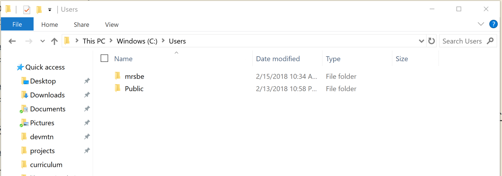

# Welcome to the Linux Subsystem!
In this guide I will walk you through setting up the Linux Subsystem for Windows 10, changing your Linux system to use the same home directory as your Windows system, and setting up your shiny new Bash terminal to use it for development.

## Preparing Your Computer
We need to check your version of Windows
Open Powershell and run <br/>
`systeminfo | Select-String "^OS Name","^OS Version"`

### OS Version 16215 and newer 
Follow [these](https://docs.microsoft.com/en-us/windows/wsl/install-win10) directions

### Older OS Versions
1) Open Powershell as Administrator
2) Run `Get-WindowsOptionalFeature -Online -FeatureName Microsoft-Windows-Subsystem-Linux`
3) Run `Enable-WindowsOptionalFeature -Online -FeatureName Microsoft-Windows-Subsystem-Linux`. This will probably have you reboot your computer.
4) Open cmd.exe and run `bash` to install Linux

Based on [these](https://docs.microsoft.com/en-us/windows/wsl/install-win10#for-anniversary-update-and-creators-update-install-using-lxrun) directions

## Changing Your Home Directory
1) Open Ubuntu
2) Enter the command `sudo nano /etc/passwd` <br/>
Find your account's line, which might look like:
`beth:x:1000:1000:,,,:/home/beth:/bin/bash`
3) Open your file explorer, navigate to `C:\Users\` and find what your home directory is called. This is usually similar to the username you use to log into Windows. For example, mine is "mrsbe" <p align="center"></p>
4) Change the home directory that we found in vim, which above is `/home/beth`, to the new directory, using WSL notation. It should look like <code>YOUR_LINUX_USERNAME:x:1000:1000:,,,:/mnt/c/Users/YOUR_HOME_DIRECTORY:/bin/bash</code>
5) Save the file
6) Exit Ubuntu and re-launch it
7) To test, use the commands: `cd ~` and `pwd`

## Updating Bash
1) Open Ubuntu
2) Run `sudo apt-get update`
3) Close Ubuntu and restart it

## Setting up Dev Tools
Run the following block of code to add all the basic packages you use in your code. This will take a while, so get comfy
```
sudo apt -qq install git
sudo apt -qq install nodejs
sudo apt -qq install npm
sudo npm i n -g 
sudo n latest
sudo npm i npm@latest -g
sudo apt -qq install python-pip
sudo npm i -g create-react-app nodemon live-server
```
Close Ubuntu and restart it. Now run the next block of code to be able to use the 'open' command.
```
echo "open() {" >> ~/.bashrc
echo "last=\${1: -1}" >> ~/.bashrc
echo "if [ \$last = / ]" >> ~/.bashrc
echo "then" >> ~/.bashrc
echo "file=\${1::-1}" >> ~/.bashrc
echo "else" >> ~/.bashrc
echo "file=\$1" >> ~/.bashrc
echo "fi" >> ~/.bashrc
echo "cmd.exe /C start \"\${file}\"" >> ~/.bashrc
echo "}" >> ~/.bashrc
```
## Setting your VSCode integrated terminal
This part is super easy. Open VSCode, hit ` CTRL + SHIFT + P` and select 'Preferences: Open User Settings'. For the "terminal.integrated.shell.windows" key, set the value to "bash.exe"
